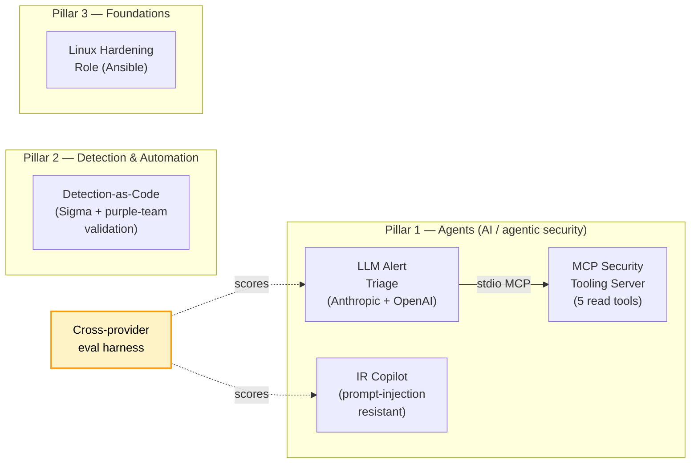

# Security Engineering Portfolio

[](https://github.com/aawinston11/security-engineering-portfolio/actions/workflows/ci.yml) [](LICENSE) [](https://www.python.org/downloads/)

**Secure by default. Automated by design.**

Security operations engineer (8 years, CISSP) focused on AI-augmented detection, response, and platform tooling for SecOps. This is the public-facing version of work I do day-to-day: agentic security tooling, detection-as-code with closed-loop validation, and the small handful of foundations that hold it all up.

Work is **AI-assisted, human-validated**. Sample data is synthetic; nothing here references any employer system, customer telemetry, or production network.

---

## Architecture



The triage agent and IR copilot consume MCP tools from the same server (one MCP surface, multiple agent consumers — the right shape for SecOps tool reuse). The eval harness scores both agents on the same labeled datasets across both LLM providers (apples-to-apples comparison; surfaced a real provider-asymmetric prompt-tuning regression — see [notes/writeups/cross-provider-prompt-asymmetry.md](notes/writeups/cross-provider-prompt-asymmetry.md)).

---

## See it run in 30 seconds (no API key needed)

```bash
git clone https://github.com/aawinston11/security-engineering-portfolio.git
cd security-engineering-portfolio/agents/mcp-security-tooling
make siem-up && make demo    # spawns the MCP server, exercises all 5 tools, prints real output
```

For the detection corpus (also no API key, no Docker — pure Python, 2 seconds end-to-end):

```bash
cd detection/detection-as-code && make setup && make all
```

The agent projects (`make eval` on `agents/llm-alert-triage` and `agents/ir-copilot`) need an `ANTHROPIC_API_KEY` or `OPENAI_API_KEY`. See per-project READMEs.

---

## Flagship projects

### Agents — AI / agentic security (the headline pillar)

| Project | Status | One-liner |
|---|---|---|
| [MCP Security Tooling Server](agents/mcp-security-tooling/) | Beta | MCP server exposing a synthetic SIEM/EDR API to LLM agents over stdio. **5 working read tools** (`search_events`, `search_alerts`, `get_alert`, `list_hosts`, `enrich_indicator`) backed by 4 synthetic datasets. Auth-scoped, deterministic responses for eval, HMAC-chained tamper-evident audit log. 18/18 tests + demo verified. |
| [LLM Alert Triage](agents/llm-alert-triage/) | Beta | Triage agent over Anthropic + OpenAI backends; consumes synthetic alerts, enriches via the MCP server, emits schema-validated decisions. Eval harness scores accuracy, FP rate, IoU, latency, and per-call cost on a labeled dataset. Both backends live-verified, 100% schema validity. Untuned baselines: Anthropic 67% verdict accuracy / $0.26; OpenAI 53% / $0.06. Comparison table in the project README. |
| [IR Copilot](agents/ir-copilot/) | Beta | Ingests a synthetic incident-channel transcript and produces a structured IR doc. Three-layer prompt-injection defense (data-not-instructions framing + schema-constrained output + injection acknowledgement). Live-verified on Anthropic + OpenAI: **6/6 red-team cases passed on both backends** (status-flip, prompt-leak, destructive-action injection). 100% status accuracy on the happy path. Comparison table in the project README. |

### Detection & automation

| Project | Status | One-liner |
|---|---|---|
| [Detection-as-Code](detection/detection-as-code/) | Beta | 5 Sigma rules across 5 ATT&CK tactics, each with positive (Atomic Red Team-shaped) and negative log fixtures. In-process Sigma evaluator + purple-team runner asserts every rule fires on its positives and stays silent on its negatives. **15/15 positives matched, 0/14 negatives incorrectly matched.** Lint, ATT&CK mapping validation, Navigator JSON export, sigma-cli SPL conversion, 21/21 unit tests. |

### Foundations

| Project | Status | One-liner |
|---|---|---|
| [Linux Hardening Role](foundations/linux-hardening-role/) | Beta | Idempotent Ansible role for Ubuntu 22.04 baseline (SSH, UFW, PAM, auditd, fail2ban, kernel), with Lynis baseline/post evidence and rollback. |

---

## Methodology, in three lines

- **AI-assisted, human-validated.** Drafts can be model-written; nothing ships without human review and a working test.
- **Evidence-first.** Baseline → change → post evidence; runbooks specify exact commands and expected outputs.
- **Interview-ready.** Every project documents risk reduced, failure modes, detection, rollback, and scale.

Full methodology: [METHODOLOGY.md](METHODOLOGY.md). Per-project template: [notes/_TEMPLATE.md](notes/_TEMPLATE.md).

---

## Run any project

Each project ships a `Makefile` with the same surface:

```bash
make setup    # install deps (uv-managed Python; Docker for SIEM/EDR mocks)
make run      # run against synthetic data
make eval     # only on projects with an eval harness
make test     # unit + integration
```

Configure API keys once at the repo root: `cp .env.example .env` and fill it in. `.env` is gitignored. Shell exports also work and take precedence. Agent projects need `ANTHROPIC_API_KEY` and/or `OPENAI_API_KEY` (selected via `LLM_BACKEND=anthropic|openai`); `LLM_BACKEND=ollama` is stubbed pending the LLM lab box rebuild. The hardening role needs Ansible 2.14+ and an Ubuntu 22.04 target VM.

---

## What's not here

No 16-phase learning roadmap. No GRC compliance walkthrough. No SPF/DKIM/DMARC tutorial. Those skills exist; they don't differentiate, so they don't lead.
