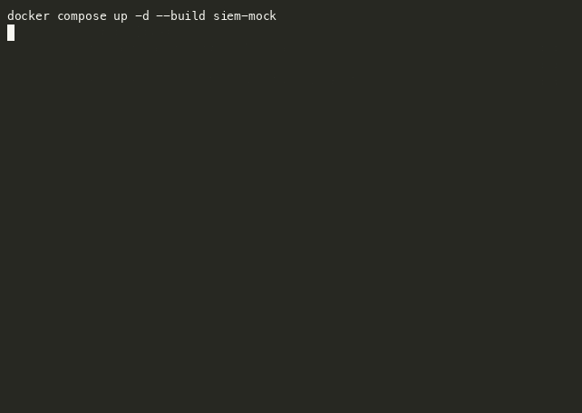

# MCP Security Tooling Server

A Model Context Protocol server that exposes a synthetic SIEM/EDR API to LLM agents — five auth-scoped read tools, deterministic responses for evals, and a tamper-evident audit trail.

**Status: Beta.** Five working tools (`search_events`, `search_alerts`, `get_alert`, `list_hosts`, `enrich_indicator`) backed by four synthetic datasets (events, alerts, hosts, indicators). HMAC-chained audit log verifies on every write. End-to-end verified: 18/18 tests, demo client exercises every tool.



---

## Problem

Letting an LLM agent take action against a SIEM or EDR is mostly a tooling problem. Agents need typed, auth-scoped tools with predictable shapes, and the security team needs to know exactly what the agent did and why. Most "AI for security" demos hand-roll one-off function-calling prompts that don't compose, don't audit, and don't move between models. MCP solves the contract; this project shows what a SecOps-shaped MCP surface looks like.

## What's shipped

- **Synthetic SIEM mock** (FastAPI, Dockerized) with four datasets:
  - `events.jsonl` — ~20 process-creation / SSH / WMI events covering encoded PowerShell, brute force, credential dumping, lateral movement, plus benign noise.
  - `alerts.jsonl` — historical alert records (closed + open, with verdicts) so triage agents can look up "what other alerts has this host had?"
  - `hosts.jsonl` — asset inventory (hostname, IP, OS, owner, department, criticality).
  - `indicators.jsonl` — threat-intel enrichment for known malicious/suspicious IPs and domains.
- **Five MCP tools** (FastMCP, stdio transport):
  - `search_events(query, limit)` — key=value search over the event corpus
  - `search_alerts(query, limit)` — same query language over alert history
  - `get_alert(alert_id)` — single-alert fetch; returns `{found: false}` for unknown IDs
  - `list_hosts(query, limit)` — asset-inventory lookup
  - `enrich_indicator(indicator)` — TI enrichment; returns `{known: false}` for unseen indicators (absence of TI is informative product behavior, not an error)
- **API-key authentication** with the SIEM mock; tool docstrings describe the expected scope (`read:events`, `read:alerts`, `read:assets`, `read:indicators`). Containment-class tools (`quarantine_host`, etc.) are the next surface and will require an `act:contain` scope plus a separate API key.
- **HMAC-chained audit log** — append-only, tamper-evident. Each entry signs `(prev_signature || payload)`, so single-line edits break verification. Verified by `AuditLog.verify()`.
- **Demo client** that spawns the server as a subprocess, lists tools, and exercises every tool end-to-end with realistic queries.
- **Tests** covering SIEM auth (events / alerts / hosts / indicators each tested), query filtering, determinism, 404 vs unknown-indicator semantics, and audit-log integrity (writes, tamper detection, wrong-key detection).

## How it works

```
                                             [ Claude Desktop / mcp dev / agent client ]
                                                              │
                                                              │  stdio
                                                              ▼
                                     [ MCP server: 5 tools + audit ]
                                                              │
                                                              │  HTTP + X-API-Key
                                                              ▼
[ events.jsonl  alerts.jsonl  hosts.jsonl  indicators.jsonl ] [ FastAPI SIEM mock ]
        committed corpus                                       /health, /events/search,
                                                               /alerts/search, /alerts/{id},
                                                               /hosts, /indicators/{value}
```

- **Transport:** MCP over stdio. The MCP client (Claude Desktop, the `mcp dev` inspector, or our `demo.py`) launches the server as a subprocess and speaks the protocol over its stdin/stdout.
- **Backing service:** FastAPI app reading from the four `data/*.jsonl` files. Runs in Docker (see `docker-compose.yml`). Listens on `localhost:8765`.
- **Auth:** API key. The dev key (`dev-readonly-key`) is checked into the compose env; production deployments would use a secret manager.
- **Determinism:** every endpoint returns the same response for the same inputs. Nothing about results depends on time, randomness, or external services. The corpus is committed.
- **Audit:** every tool invocation appends an entry to `audit/audit.jsonl` containing the timestamp, tool name, SHA-256 of the args, SHA-256 of a result summary, and an HMAC-chained signature. `AuditLog.verify()` returns False on any tamper or wrong key.

## Run it

**Prerequisites:** Python 3.11+, [`uv`](https://docs.astral.sh/uv/) (`brew install uv` or `curl -LsSf https://astral.sh/uv/install.sh | sh`), Docker.

```bash
make help           # list all targets
make setup          # uv sync (Python 3.11+ required)
make siem-up        # docker compose: SIEM mock at http://localhost:8765
make demo           # spawn server, list 5 tools, exercise each end-to-end
make test           # pytest: 18/18 — SIEM auth/query/determinism + audit chain
make run            # prints the command to start the MCP server interactively
```

To use the server from Claude Desktop, add to your `claude_desktop_config.json`:

```json
{
  "mcpServers": {
    "security-tooling": {
      "command": "uv",
      "args": ["--directory", "/path/to/agents/mcp-security-tooling", "run",
               "python", "-m", "mcp_security_tooling.server"],
      "env": {
        "SIEM_BASE_URL": "http://localhost:8765",
        "SIEM_API_KEY": "dev-readonly-key"
      }
    }
  }
}
```

## Layout

```
agents/mcp-security-tooling/
├── pyproject.toml             # uv-managed
├── Makefile
├── docker-compose.yml         # SIEM mock service
├── Dockerfile.siem
├── data/
│   ├── events.jsonl           # ~20 synthetic events
│   ├── alerts.jsonl           # 10 historical alert records
│   ├── hosts.jsonl            # 8-host asset inventory
│   └── indicators.jsonl       # 5 known indicators
├── src/
│   ├── siem_mock/app.py       # FastAPI: events / alerts / hosts / indicators
│   └── mcp_security_tooling/
│       ├── server.py          # FastMCP server: 5 read tools
│       ├── audit.py           # HMAC-chained audit log
│       └── demo.py            # client demo
└── tests/test_e2e.py          # SIEM HTTP + audit chain
```

## Interview-ready

_Filled in once enough downstream-agent runs are archived to discuss tool-call patterns. Will document: risk reduced (auditable, scoped agent access vs. hand-rolled function-calling), failure modes (audit log unverifiable on tamper, schema drift between MCP and SIEM, scope leakage), detection (audit-log verification on every read, scope mismatch alerts, anomalous tool-call frequency per agent identity), rollback (containment tools are no-ops in this scaffold; production rollback would be SIEM-native), scale (per-agent rate limits, scope-derived quotas, audit-log shipping to long-term storage)._

## References

- Model Context Protocol — https://modelcontextprotocol.io
- MCP Python SDK / FastMCP — https://github.com/modelcontextprotocol/python-sdk
- MITRE ATT&CK — https://attack.mitre.org
- NIST SP 800-53 — AU-2 (audit events), AU-9 (protection of audit information)
