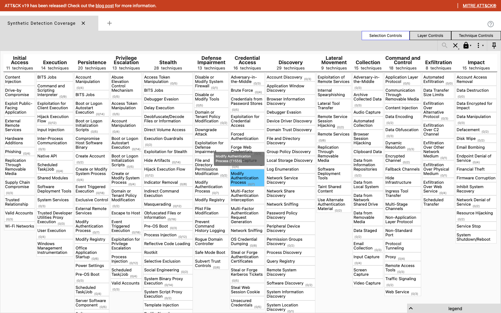

# Detection-as-Code

Sigma detection corpus with **fixture-based purple-team validation** and ATT&CK Navigator coverage export. Each rule ships with positive and negative log fixtures; the `purple-team` runner replays those fixtures through an in-process Sigma evaluator and asserts the rule's detection logic produces the expected hits. CI signal: `make all` is green only when every rule lints clean AND every positive fixture matches AND zero negative fixtures match.

**Status: Beta.** 5 rules across 5 ATT&CK tactics, 14 positive fixtures + 12 negative fixtures, 100% purple-team pass rate, in-process Sigma evaluator, ATT&CK Navigator JSON exporter, sigma-cli SPL conversion. 21/21 unit tests pass (Sigma evaluator + corpus validation).



*Generated by `make navigator` and rendered via [mitre-attack.github.io/attack-navigator](https://mitre-attack.github.io/attack-navigator/). The JSON layer (`build/attack-navigator-layer.json`) is loadable via the Navigator's "Open Existing Layer" → "Upload from local" flow.*

---

## Problem

Most detection content is paste-into-the-console-and-pray: no review, no tests, no link between "we wrote a rule for T1059.001" and "T1059.001 actually fires the rule." This project closes the loop. Every rule is paired with positive log fixtures (representing what an Atomic Red Team execution of that technique would produce) and negative fixtures (legitimate activity that should *not* match), and a runner asserts the rule fires on the positives and stays silent on the negatives. CI fails on regression — same loop a real purple-team exercise produces, just with the Atomic Red Team execution replaced by deterministic fixtures so the run is reproducible without standing up a SIEM container.

## What's shipped

- **5 Sigma rules** across 5 ATT&CK tactics:
  - Execution: `T1059.001` Encoded PowerShell command execution
  - Credential Access: `T1003.001` LSASS dumping (mimikatz, procdump targeting lsass, `sekurlsa` keyword)
  - Persistence: `T1053.005` Scheduled task created from a user-writable path
  - Lateral Movement: `T1021.002` Remote ADMIN$ / C$ / IPC$ access (with loopback filter)
  - Command and Control: `T1105` curl-piped-to-shell ingress tool transfer
- **26 fixtures total** — 14 positive (one per realistic execution variant, e.g. mimikatz vs procdump vs sekurlsa via rundll32) and 12 negative (benign activity that shares surface features but should not match).
- **In-process Sigma evaluator** (`sigma_runtime.py`) — supports `equals`, `contains`, `startswith`, `endswith`, `re` modifiers; list-valued OR semantics; conditions with `and`, `or`, `not`, parentheses, `1 of <prefix>*`, `all of <prefix>*`. Tested against the modifiers listed AND the negative-filter idiom (`selection and not filter_local`).
- **`make lint`** — schema check on every rule (required fields, valid level/status, well-formed `attack.tNNNN` tags, condition reference, fixture presence).
- **`make purple-team`** — runs every rule against its fixtures. Per-rule report shows positives matched, negative regressions, and which specific fixture (by Atomic Red Team test ID) failed. Exit code is non-zero on any failure — drop into CI.
- **`make navigator`** — emits a MITRE ATT&CK Navigator JSON layer covering every technique with at least one rule. Loadable at https://mitre-attack.github.io/attack-navigator/.
- **`make convert`** — converts each Sigma rule to Splunk SPL via `sigma-cli`. Output goes to `generated-spl/`. Not committed (regenerate per pysigma version).

## How it works

```
rules/<tactic>/<technique>/
├── rule.yml                    # Sigma source, with attack.tNNNN tags
├── should_match.jsonl          # positive fixtures (ART-style technique outputs)
└── should_not_match.jsonl      # negative fixtures (benign noise)
                                            │
                                            ▼
                       loader.py: yaml.safe_load + jsonl
                                            │
                                            ▼
                       ┌────────────────────┴────────────────────┐
                       │                    │                    │
                  lint.py             purple_team.py        navigator.py
              schema validate    sigma_runtime evaluator     ATT&CK layer
              ATT&CK mapping       per-fixture assertion       JSON export
```

The Sigma evaluator parses the rule's `detection` block once, builds a per-selection boolean for the event, and evaluates the `condition` expression against those booleans. The condition parser is a small recursive-descent (about 50 lines) supporting the operators above. Aggregation, count, and correlation rules aren't supported — for those, the rule should run in your SIEM via the converted SPL/KQL.

The **fixture pattern is the load-bearing convention**. Every positive fixture is tagged with `_atomic_test_id` mapping it to an Atomic Red Team test, so when you want to graduate from synthetic fixtures to real ART executions, the runner shape doesn't change — you swap the fixture source for ART output and the same rule body still gets validated.

## Run it

**Prerequisites:** Python 3.11+, [`uv`](https://docs.astral.sh/uv/) (`brew install uv` or `curl -LsSf https://astral.sh/uv/install.sh | sh`). No SIEM, no Docker, no LLM. Setup-to-`make all`-green is ~2 seconds.

```bash
make help                   # list all targets
make setup                  # uv sync + sigma-cli + pysigma-backend-splunk
make lint                   # schema + ATT&CK mapping + fixture presence checks
make purple-team            # fixture-based detection validation (1 = any failure)
make navigator              # writes build/attack-navigator-layer.json
make convert                # writes generated-spl/<tactic>/<rule>.spl per rule
make test                   # pytest: evaluator + corpus
make all                    # lint + validate-attack-mappings + purple-team
```

## Layout

```
detection/detection-as-code/
├── pyproject.toml
├── Makefile
├── rules/
│   ├── execution/T1059.001_encoded_powershell/
│   │   ├── rule.yml
│   │   ├── should_match.jsonl
│   │   └── should_not_match.jsonl
│   ├── credential_access/T1003.001_lsass_dump/
│   ├── persistence/T1053.005_scheduled_task/
│   ├── lateral_movement/T1021.002_admin_share_access/
│   └── command_and_control/T1105_curl_pipe_bash/
├── src/detection_as_code/
│   ├── sigma_runtime.py        # in-process evaluator (modifiers + condition parser)
│   ├── loader.py               # rule + fixture loading
│   ├── lint.py                 # schema / mapping / fixture presence checks
│   ├── purple_team.py          # per-rule fixture validation
│   ├── navigator.py            # ATT&CK Navigator JSON layer builder
│   └── cli.py                  # entry points
└── tests/
    ├── test_sigma_runtime.py   # evaluator semantics
    └── test_corpus.py          # corpus lints clean + purple-team passes
```

## Adding a new rule

1. Create `rules/<tactic>/<technique_id>_<short_name>/rule.yml`.
2. Tag with `attack.tNNNN[.NNN]` (the lint will fail without it).
3. Add `should_match.jsonl` with one or more positive fixtures (each tagged `_atomic_test_id`).
4. Add `should_not_match.jsonl` with at least one realistic-looking negative.
5. Run `make all` — lint must pass and purple-team must report positives matched, zero negative regressions.

## Interview-ready

_Filled in once enough purple-team runs across multiple corpora are archived to discuss coverage trends. Will document: risk reduced (analyst time wasted on rule regressions, mean-time-to-detect drift), failure modes (rule body diverging from converted SPL after Sigma backend changes; fixtures going stale as ART evolves; negative fixtures that *should* be negative becoming malicious as TTPs shift), detection (CI signal on every PR, navigator coverage trend), rollback (Sigma is the source of truth; converted SPL can always be regenerated), and scale (one fixture per ART variant; corpus grows linearly with TTP coverage)._

## References

- [MITRE ATT&CK](https://attack.mitre.org)
- [MITRE ATT&CK Navigator](https://mitre-attack.github.io/attack-navigator/)
- [Sigma — generic detection format](https://github.com/SigmaHQ/sigma)
- [pySigma — conversion library](https://github.com/SigmaHQ/pySigma)
- [Atomic Red Team — adversary technique tests](https://github.com/redcanaryco/atomic-red-team)
